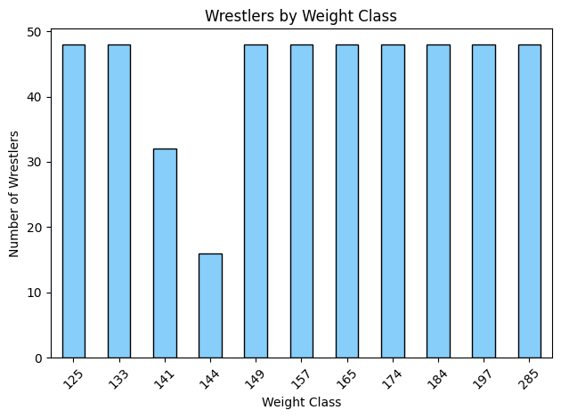
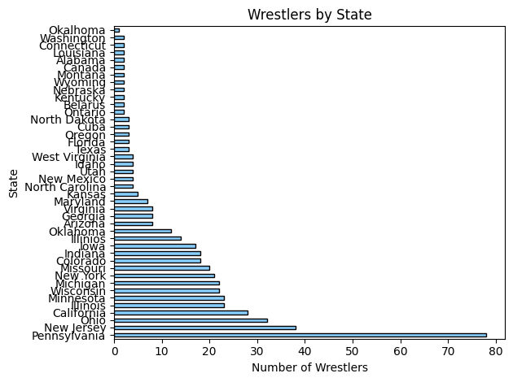

# NCAA Wrestling Data Analysis 🏋️‍♂️📊

This project analyzes NCAA wrestling data to uncover trends in weight class distribution, geographic representation, and placement outcomes. Using Python in Jupyter Notebook, we processed, cleaned, and visualized the data to extract meaningful insights for performance analysis.

## 📌 Project Overview

- **Goal:** Identify patterns in NCAA wrestling performance based on geography, weight class, and placement.
- **Deliverable:** A series of visualizations and statistical insights to support decision-making for coaches and recruiters.

## 🧰 Tools & Technologies

- **Language:** Python  
- **Environment:** Jupyter Notebook  
- **Libraries:** `pandas`, `matplotlib`, `seaborn`

## 📈 Key Features

- Cleaned and preprocessed raw NCAA wrestling data
- Analyzed weight class participation and placement trends
- Mapped top-performing states and high schools
- Visualized performance distributions across multiple dimensions

## 🏆 Impact

The final analysis was presented to the UNC wrestling coaching staff to assist in data-informed recruitment and athlete development strategies.

## 📂 Files

- `main.ipynb` – Core notebook with code, analysis, and visualizations
- `ncaa_data.csv` – Dataset used for analysis
- `visualization1-5.png` – Output plots for visual storytelling

## 🔍 Example Visuals

## 🤝 Contributions

Feel free to fork, open issues, or suggest improvements!

---

**Authors:** [Kashyap Kannajyosula] [Aneesh Sudigala]
**Contact:** [Personal: kashkanna22@gmail.com] [School: kashyapk@unc.edu]
